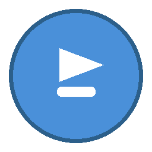

# InputHelper

<p align="center">
  
</p>

<p align="center">
  <strong>智谱AI / 通义千问 语音输入自动化助手</strong>
</p>

<p align="center">
  
  
  
</p>

---

## 简介

InputHelper 是一款 Windows 桌面自动化工具，通过 **OpenCV 模板匹配** 和 **VOSK 离线语音识别**，实现语音输入的全流程自动化。支持 **智谱AI输入法** 和 **通义千问语音输入** 两种模式，并可选配 **唤醒词** 功能，说出关键词即可自动启动语音流程。

### 核心特性

| 特性 | 说明 |
|------|------|
| **双输入法支持** | 智谱AI（模板匹配全自动） / 千问（右ALT键+自动回车） |
| **唤醒词检测** | 后台持续监听麦克风，说出唤醒词自动启动流程（VOSK 离线） |
| **空闲超时休眠** | 可配置超时时间，超时后自动回到唤醒词监听模式 |
| **自适应采样控制** | 基于《工程控制论》的变采样率策略，状态不同采样频率不同 |
| **前馈-反馈复合控制** | 动作前预测UI变化，减少不必要的等待和检测 |
| **多尺度模板匹配** | 自动适配不同 DPI 和 UI 缩放，抗界面变化 |
| **UI 位置学习** | 自动学习模板位置，后续搜索缩小区域，加速匹配 |
| **系统自动辨识** | 冷启动测量系统延迟参数，优化前馈控制时机 |

### 工作流程

```
┌─────────────────────────────────────────────────────────────┐
│                     InputHelper 架构                         │
├─────────────────────────────────────────────────────────────┤
│                                                             │
│  ┌──────────────┐    ┌──────────────┐    ┌───────────────┐  │
│  │  唤醒词检测   │───▶│  状态机引擎   │───▶│  执行器       │  │
│  │  (VOSK离线)  │    │  (自适应控制) │    │  (键鼠/模板)  │  │
│  └──────────────┘    └──────────────┘    └───────────────┘  │
│         │                   │                    │          │
│         ▼                   ▼                    ▼          │
│  ┌──────────────┐    ┌──────────────┐    ┌───────────────┐  │
│  │  麦克风输入   │    │  前馈预测器   │    │  屏幕截图     │  │
│  │  16kHz/16bit │    │  系统辨识     │    │  OpenCV匹配  │  │
│  └──────────────┘    └──────────────┘    └───────────────┘  │
│                                                             │
└─────────────────────────────────────────────────────────────┘
```

## 快速开始

### 方式一：下载可执行文件

1. 从 [Releases](https://github.com/YOUR_USERNAME/InputHelper/releases) 下载 `InputHelper.exe`
2. 双击运行即可

### 方式二：从源码运行

```bash
# 1. 克隆仓库
git clone https://github.com/YOUR_USERNAME/InputHelper.git
cd InputHelper

# 2. 安装依赖
pip install -r requirements.txt

# 3. 运行托盘版（推荐）
python tray_app.py

# 或直接运行主程序
python main.py
```

### 依赖安装说明

```bash
# Windows 上 PyAudio 可能需要额外安装
pip install pipwin
pipwin install pyaudio

# 或直接下载 wheel 安装
# https://www.lfd.uci.edu/~gohlke/pythonlibs/#pyaudio
```

## 使用方法

### 智谱AI 模式

1. 打开设置 → 选择 **智谱AI输入法**
2. 运行截图工具 `python capture.py`，截取智谱语音条的 6 个模板
3. 保存设置 → 点击 **开始语音输入**
4. 助手自动完成：激活语音 → 等待说话 → 确认 → 复制 → 粘贴发送

### 千问语音输入 模式

1. 打开设置 → 选择 **通义千问语音输入**
2. 点击 **开始语音输入**
3. **按住右 ALT 键** 说话 → **松开** 后助手自动按回车发送

### 唤醒词功能（仅智谱AI模式）

1. 打开设置 → 切换到 **唤醒词** 标签页
2. 勾选 **启用唤醒词检测**
3. 设置唤醒词（默认：`开始输入`）
4. 设置空闲超时时间（默认：5 分钟）
5. 下载 VOSK 中文模型：
   - 访问 [https://alphacephei.com/vosk/models](https://alphacephei.com/vosk/models)
   - 下载 `vosk-model-small-cn-0.22`（约 42MB）
   - 解压到 `InputHelper/vosk_model/` 目录
6. 重启助手，说出唤醒词即可自动启动语音流程

## 设置项说明

| 设置项 | 说明 | 默认值 |
|--------|------|--------|
| 输入法选择 | 智谱AI / 通义千问 | 智谱AI |
| 语音激活快捷键 | 激活语音条的快捷键 | Alt+Space |
| 助手触发快捷键 | 手动启动助手的快捷键 | Ctrl+Alt+V |
| 静音判定帧数 | 连续多少帧未检测到"开始说话"判定为已说完 | 5 |
| 检测间隔(ms) | 屏幕检测间隔，越小反应越快但更耗CPU | 300 |
| 唤醒词 | 后台监听的唤醒词文本 | 开始输入 |
| 空闲超时(分钟) | 无操作超过此时长自动休眠 | 5 |
| 开机自动启动 | 是否随系统启动 | 关 |
| 静默启动 | 启动时仅显示托盘图标 | 关 |

## 技术架构

### 工程控制论设计

本项目基于钱学森《工程控制论》的核心思想设计：

- **前馈-反馈复合控制**：在已知系统动力学的前提下，提前预测UI变化，减少等待时间
- **变采样率控制**：根据当前状态动态调整检测频率（100ms~600ms）
- **系统辨识**：冷启动时自动测量系统关键延迟参数
- **多尺度鲁棒匹配**：通过 [0.9x, 1.0x, 1.1x] 三种尺度应对UI缩放变化
- **自适应 EMA 学习**：渐进平均算法自动学习UI元素位置，加速后续匹配

### 性能指标

| 指标 | 优化前 | 优化后 | 提升 |
|------|--------|--------|------|
| 单次 tick 延迟 | ~350ms | ~100ms | 3.5x |
| CPU 占用 | ~15% | ~7% | 50%↓ |
| 完整流程时间 | ~8-10s | ~5-6s | 40%↓ |

## 文件结构

```
InputHelper/
├── main.py              # 主程序：状态机引擎、智谱/千问工作流
├── config.py            # 全局配置参数
├── settings.py          # 用户设置管理（JSON持久化）
├── detector.py          # 视觉检测：模板匹配、多尺度、批量匹配
├── controller.py        # 执行器：键鼠模拟
├── wake_word.py         # 唤醒词检测：VOSK离线识别
├── region_learner.py    # UI位置学习：EMA渐进平均
├── gui.py               # 设置面板UI
├── tray_app.py          # 托盘应用入口
├── capture.py           # 模板截图工具
├── sound.py             # 提示音
├── utils.py             # 工具函数
├── gen_templates.py     # 模板生成脚本
├── make_icon.py         # 图标生成脚本
├── requirements.txt     # Python依赖
├── InputHelper.spec     # PyInstaller打包配置
└── templates/           # 模板图片目录
```

## 打包 EXE

```bash
pip install pyinstaller
pyinstaller InputHelper.spec
```

生成的 `dist/InputHelper.exe` 即为可执行文件。

## 快捷键

| 快捷键 | 功能 |
|--------|------|
| `Ctrl+Shift+Q` | 停止助手 |
| `Ctrl+Alt+V` | 启动助手（可自定义） |
| `Alt+Space` | 激活语音条（智谱模式，可自定义） |

## 常见问题

**Q: 唤醒词功能无法使用？**
A: 需要下载 VOSK 中文模型并放置到 `vosk_model/` 目录。推荐使用 `vosk-model-small-cn-0.22`。

**Q: 模板匹配不准确？**
A: 请重新运行 `python capture.py` 截取当前版本的模板图片。不同版本的智谱AI界面可能有差异。

**Q: PyAudio 安装失败？**
A: Windows 上建议先安装 `pipwin`，然后 `pipwin install pyaudio`。或从 [Christoph Gohlke 的页面](https://www.lfd.uci.edu/~gohlke/pythonlibs/#pyaudio) 下载对应版本的 wheel 文件手动安装。

## License

MIT License

## 致谢

- [OpenCV](https://opencv.org/) - 模板匹配
- [VOSK](https://alphacephei.com/vosk/) - 离线语音识别
- [PyAutoGUI](https://pyautogui.readthedocs.io/) - 键鼠自动化
- [PyInstaller](https://pyinstaller.org/) - 打包工具
